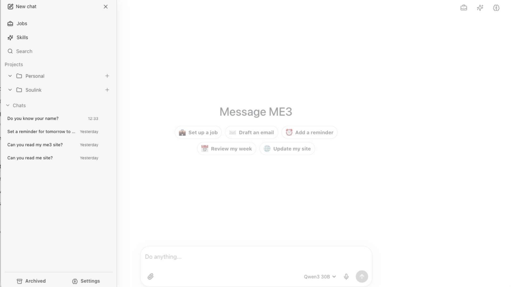

# 🤖 ME3

**A free, open-source personal OS and AI assistant**

Ready to take ownership of your digital life? ME too!

With ME3, now you can.

(Note: some features require $5/month 'workers paid' plan in Cloudflare) 

## ☁️ Install

1. 
2. Follow the yellow brick road (steps).
3. Name ME3 and train ME3.

## 🤔 Why ME3?

Why You!? Let ME3 tell you...

They (whoever they are) want you locked in.

Pampered by convenience, endless subscriptions, chi-sucking feeds and doom-scrolling.

Consume. Consume. Consume.

No! No more. Not ME3.

We're on a mission, you see, and any **mission-bearing soul needs an assistant** to take care of as much matrix donkey work as possible, so you have more time to 🧘‍♀️ remember and 💥 unleash the innate genius ❤️ you were born with.

It's time, grasshopper... time to take ownership of your digital life.

## 🖥️ What's in ME3

- **🚀 Mission Control** for you, the HUMAN.
- **🤖 An AI Assistant** you control. Pick its brains 🧠. Give it jobs 💼.
- **📧 Email** for you, your assistant or whoever will free you from 3000 unread inbox messages. An end to email slavery. That's the goal, Obe Wan.
- **📆 A Calendar** your assistant helps you manage so you can spend more time with other humans.
- **🧩 Plugins**: you can build, extend and modify to make ME3 yours.
- **🌐 A ME3 profile**: that doubles as a personal website if you need it. (Do we even need those anymore? Yes, yes, we do, trust me, you'll see). Think of it like a digital business card. It uses the [ME3 Protocol](https://me3.app/protocol) so AI agents know who you are.

## 🕰️ After setup

Be honest, you were never going to read the docs, so ME3 ate them all.

Once you're set up, you can ask him/her/it anything you need to know, like how to:

- configure a custom domain
- run the app locally
- create your own plugin

## 😘 Support

ME3 is open source. Donations to Soulink Foundation CLG (non-profit) help support ongoing
development, maintenance, and open technology infrastructure.

[Support Soulink Foundation](https://soulinkfoundation.org/support)

## License

[MIT](./LICENSE)
